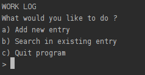
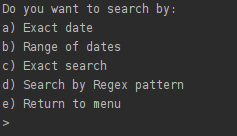
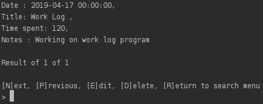

# Work Log
Python Web Development Techdegree Project 3 - Work Log

## Description
In order to prepare better timesheets for your company, you've been asked to develop 
a terminal application for logging what work someone did on a certain day. 
The script should ask for a task name, how much time was spent on the task, 
and any general notes about the task. Record each of these items into a row of a CSV or
JSON file along with a date.

Provide a way for a user to find all of the tasks that were done on a certain date or 
that match a search string (either as a regular expression or a plain text search). 
Print a report of this information to the screen, including the date, title of task, 
time spent, and general notes.

This is the screenshot of main menu

This program is also able to search within the work log database

Example of log data display

## Instructions:

run `python main.py`

Note: you should have Python 3.6 or later installed in your computer.